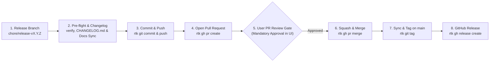

# AGENTS.md

**Project:** `agent-skills` (Canonical Agent Skills Catalog)  
**Purpose:** Open-standard Agent Skills monorepo implementing and distributing autonomous AI coding assistant skills (including the 5-phase QRSPI methodology) across all major harnesses (Gemini, Claude, Codex, OpenCode) and `skills.sh`.  
**Audience:** AI agents and platform engineers contributing to or maintaining skills in this repository.  
**Standard:** [agentskills.io Open Specification](https://agentskills.io/specification)  
**Documentation & Code Language:** English (all code, templates, scripts, and documentation).  
**Version:** 1.12.3  

---

## 1. Vision & Architectural Invariants

This repository is the canonical reference implementation and distribution package for the **QRSPI Methodology Agent Skill**. Every contributor and AI agent modifying this codebase must uphold five non-negotiable invariants:

1. **Strict agentskills.io Compliance:** `SKILL.md` must adhere to the open specification. The YAML frontmatter must validate with valid kebab-case name, description under 1024 characters with explicit semantic triggers, and standard metadata.
2. **Progressive Disclosure Architecture:** Keep `SKILL.md` token-light (< 500 tokens for discovery). Defer granular checklists and stage templates to `references/` for on-demand retrieval.
3. **Pure POSIX Compliance (Zero Host Dependencies):** All shell scripts (`.github/scripts/*.sh`, `skills/*/scripts/*.sh`, `skills/*/hooks/*.sh`) must be pure POSIX `/bin/sh`-compliant, executable across macOS, Linux, and BSD without requiring bash, python, or external dependencies.
4. **Dogfooding & Modular Persistence:** Any complex feature or refactoring must use the modular session structure (`INDEX.md` and `YYYY-MM-DD-<slug>/1-question.md` through `5-implement.md`). By default, sessions live under `.qrspi/`, with configurable support for `.docs/`, `.implementations/`, or `.sessions/` defined in `AGENTS.md` or user preference.
5. **Mandatory Turn Termination & User Sign-Off:** Exactly one phase executed per turn. After persisting each phase artifact, the agent MUST stop calling tools, output its summary/questions, and end its turn, waiting for explicit user approval before advancing.

---

## 2. Repository Architecture & Layout

```text
.
├── .github/
│   ├── scripts/
│   │   └── verify-security.sh     # POSIX security auditor (Trojan Source, malware, exfil)
│   ├── workflows/
│   │   ├── ci.yml                 # CI/CD: YAML spec validation, shellcheck & multi-harness tests
│   │   └── security.yml           # Security: Gitleaks secret scanning & least-privilege audit
│   └── CODEOWNERS                 # Mandatory owner approval rules for critical paths
├── skills/
│   └── qrspi-methodology/        # 📦 Canonical Agent Skill Package
│       ├── SKILL.md               # Canonical Agent Skill definition (agentskills.io)
│       ├── README.md              # Public documentation and usage guide
│       ├── hooks/
│       │   └── prompt-hook.sh     # Agent Lifecycle Hook (Claude Code / Gemini CLI)
│       ├── references/
│       │   ├── stage-templates/   # Modular stage templates (1 file per QRSPI stage)
│       │   │   ├── 1-question.md
│       │   │   ├── 2-research.md
│       │   │   ├── 3-structure.md
│       │   │   ├── 4-plan.md
│       │   │   └── 5-implement.md
│       │   ├── index-template.md  # Template for .qrspi/INDEX.md (Living ADR)
│       │   └── phases-checklist.md # Compact phase-gate quality checklist
│       └── scripts/
│           └── verify-session.sh  # POSIX validator for modular QRSPI session directories
├── .gitignore                     # OS and editor ignore rules
├── AGENTS.md                      # Agent governance, harnessing, and release protocols
├── CHANGELOG.md                   # Version release notes following Keep a Changelog
├── LICENSE                        # MIT License
├── README.md                      # Public documentation and skills.sh index metadata
└── skills.sh.json                 # skills.sh directory grouping & metadata configuration
```

---

## 3. Harness Support & Installation Paths

The skill catalog supports installation via `npx skills add racastellanosm/agent-skills` across both **global** (`$HOME`) and **local** (workspace root `.`) scopes:

| Target Harness | Global Scope Path | Local / Workspace Scope Path |
| :--- | :--- | :--- |
| **Standard (`agentskills.io`)** | `~/.agents/skills/qrspi-methodology/` | `.agents/skills/qrspi-methodology/` |
| **Google Gemini (CLI / Antigravity)** | `~/.gemini/skills/qrspi-methodology/` | `.gemini/skills/qrspi-methodology/` |
| **Anthropic Claude (Claude Code)** | `~/.claude/skills/qrspi-methodology/` | `.claude/skills/qrspi-methodology/` |
| **OpenAI Codex / CLI** | `~/.codex/skills/qrspi-methodology/` | `.codex/skills/qrspi-methodology/` |
| **OpenCode** | `~/.opencode/skills/qrspi-methodology/` | `.opencode/skills/qrspi-methodology/` |

---

## 4. Scripting & Tooling Guardrails

- **Shellcheck Mandatory:** All `.sh` files must pass `shellcheck -s sh` with zero warnings.
- **Strict File Permissions:**
  - Directories: `755` (`drwxr-xr-x`)
  - Executables (`.github/scripts/*.sh`, `skills/qrspi-methodology/scripts/*.sh`, `skills/qrspi-methodology/hooks/*.sh`): `755` (`-rwxr-xr-x`)
  - Documentation and templates (`SKILL.md`, `*.md`): `644` (`-rw-r--r--`)

---

## 5. Quality Verification Commands

Before proposing changes or creating releases, run the following verification suite:

```bash
# 1. Validate session directory structure
./skills/qrspi-methodology/scripts/verify-session.sh skills/qrspi-methodology/references/stage-templates

# 2. Run repository security & integrity audit (Trojan Source, anti-malware, URI checks)
./.github/scripts/verify-security.sh

# 3. Verify ShellCheck on all scripts
shellcheck .github/scripts/verify-security.sh skills/qrspi-methodology/scripts/verify-session.sh skills/qrspi-methodology/hooks/prompt-hook.sh
```

---

## 6. Versioning, Commits & PR-Driven Releases (Mandatory Guardrail)

> [!CAUTION]
> **EXPLICIT USER CONSENT REQUIRED FOR COMMITS & RELEASES**  
> AI Agents **MUST NEVER** execute `git commit`, `git push`, `git tag`, `gh pr create`, `gh pr merge`, or `gh release create` without the user's **explicit instruction** in their prompt. Code changes must remain in the local working directory for user inspection until an explicit commit/push command is given.

Every release must strictly follow the **PR-Driven Release Lifecycle (Trunk-Based with Pull Requests)**. Direct pushes to `main` for releases are prohibited.



### Mandatory 8-Step Release Protocol:
1. **Branch Creation:** Create a dedicated release branch: `rtk git checkout -b chore/release-vX.Y.Z`.
2. **Pre-flight & Changelog:** Run all verification checks, verify Documentation Integrity (Section 7), update `CHANGELOG.md` following [Keep a Changelog](https://keepachangelog.com/en/1.1.0/) with the new version section, and ensure the version in `SKILL.md` frontmatter matches the target semantic version (`vX.Y.Z`).
3. **Commit & Push Branch:** Stage files and push the branch to remote:
   ```bash
   rtk git add .
   rtk git commit -m "chore(release): prepare release vX.Y.Z"
   rtk git push -u origin chore/release-vX.Y.Z
   ```
4. **Create Pull Request:** Open the PR against `main` via GitHub CLI:
   ```bash
   rtk gh pr create --base main --head chore/release-vX.Y.Z --title "chore(release): vX.Y.Z - <Title>" --body "<Summary>"
   ```
5. **User PR Review & Approval Gate (Mandatory Pause):** Output the PR link to the user and **STOP execution**. The AI Agent **MUST pause and wait for explicit user review and approval** in GitHub UI before proceeding with merge and release steps.
6. **Merge PR:** Upon receiving the user's explicit confirmation, merge the PR to `main` with squash and delete branch:
   ```bash
   rtk gh pr merge --squash --delete-branch
   ```
7. **Sync Local Main & Create Tag:** Switch to `main`, pull the merge commit, and create the annotated tag:
   ```bash
   rtk git checkout main
   rtk git pull origin main
   rtk git tag -a vX.Y.Z -m "vX.Y.Z - <Description>"
   rtk git push origin vX.Y.Z
   ```
8. **Publish GitHub Release:** Publish the official release anchored to the tag:
   ```bash
   rtk gh release create vX.Y.Z --title "vX.Y.Z - <Title>" --notes "<Release Notes>"
   ```

---

## 7. Documentation Integrity & Pre-Release Synchronization

All software engineers and AI coding assistants **MUST strictly verify documentation synchronization before closing any task and especially BEFORE creating any new version/release**:

1. **Zero Out-of-Sync Documentation:** Whenever a template, script, hook, or path is modified or added, the change **MUST immediately be reflected and synchronized** across:
   - [`AGENTS.md`](AGENTS.md) (Layout, release rules, and verification suite).
   - [`CHANGELOG.md`](CHANGELOG.md) (Semantic version notes and added/changed items).
   - [`SKILL.md`](SKILL.md) (Version metadata, phase directives, and references).
   - [`README.md`](README.md) (Layout, examples, and installation table).
2. **Pre-Release Verification Checklist:**
   - [ ] `CHANGELOG.md` updated with the new version section and date.
   - [ ] `SKILL.md` frontmatter `version:` bumped to match release tag.
   - [ ] No broken relative markdown links.
   - [ ] No machine-specific absolute host paths (`/Users/...` or `file:///...`).
   - [ ] All shell scripts pass POSIX and shellcheck audits.
   - [ ] English language standard applied to all technical documents, comments, and schemas.
